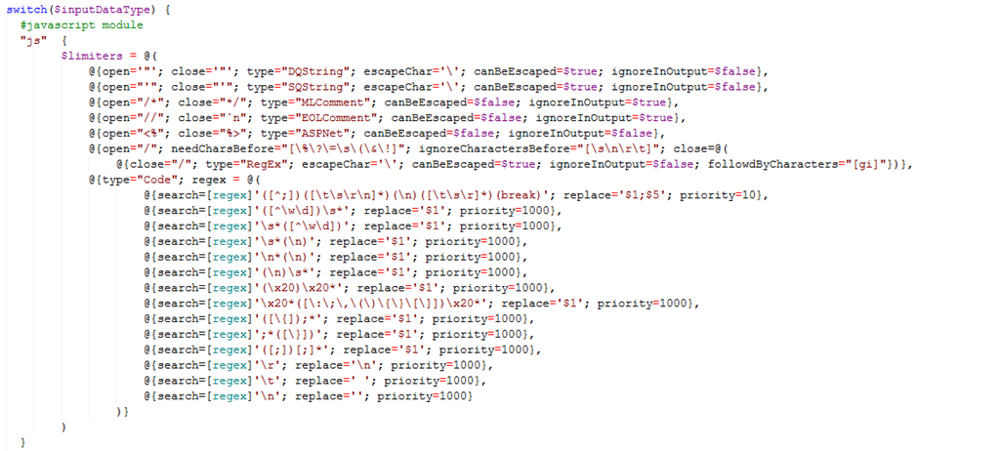
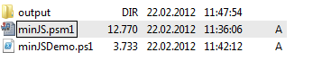
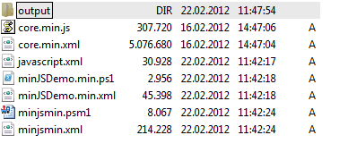
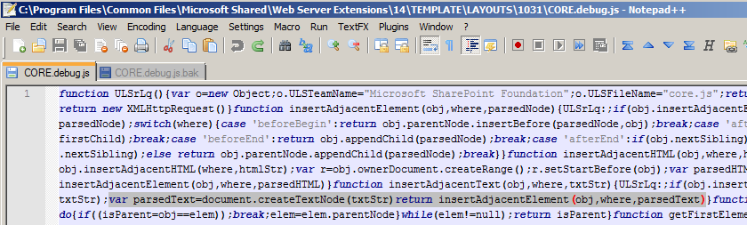
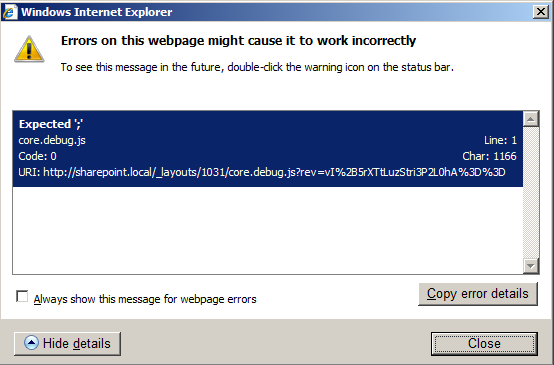

(blog article: https://ikarstein.wordpress.com/2012/02/22/minify-javascript-and-powershell-scripts-by-using-powershell/)

There are several tools out there to minify JavaScript files. – You don’t know “minification”? Look here: http://en.wikipedia.org/wiki/Minification_(programming)

Common tools are:

http://www.crockford.com/javascript/jsmin.html
http://ajaxmin.codeplex.com
For those of you that like PowerShell as I like it I’ve created a PowerShell module that let’s you minify JavaScript files and **PowerShell script files**.


**You can use the module like this:**
```PowerShell
cls

#module in the same path as the script:
Import-Module (join-path (split-path $MyInvocation.mycommand.path) "minjs")

#module in a default module path like "C:\Windows\System32\WindowsPowerShell\v1.0\Modules\minifyPS"
#Import-Module "minjs"

$str = @"
    var test = 'some JavascriptCode';
"@

$min = (minify -inputData $str -inputDataType "js")

[System.Windows.Forms.Clipboard]::SetText($min )
```

The module works like this:

1. Split script source code into typed chunks:

  + Code
  + Single Quoted String
  + Double Quoted String
  + Multiline Comment
  + End-of-line Comment
  + …
2. Remove all unwanted chunks such as comments

3. Process all remaining chunks by using regular expressions

4. Combine all processed chucks to a result string

For every language (JavaScript and PowerShell) there is a config section in the script.



There are two files in the package at Codeplex:



+ "minJS.psm1" => This is the module
+ "minJSDemo.ps1" => This is a demo script that uses the module

The demo script contains a piece of JavaScript that will be minified. And the script will minify itself and the module to an “output” sub directory that is created by the script if it does not exist.

This is a screenshot after running the demo script:

  

  If you execute “minJSDemo.min.ps1” in the output folder you execute the minified version of “minJSDemo.ps1” and the minified version of the module itself (“minJSmin.psm1”).

**The module is ALPHA at the moment.** I’ve tested it in some projects and it seems to work as expected.

I’ve tested it with a huge JavaScript file: “core.debug.js” of Microsoft SharePoint:

  `C:\Program Files\Common Files\Microsoft Shared\Web Server Extensions\14\TEMPLATE\LAYOUTS\<lcid>\CORE.debug.js`

  I’ve renamed the original file to “core.debug.js.bak”, minified it and saved the result as “code.debug.js”. So it’s used in the browser. (The minification of ~360KB takes 90 seconds.The minification module is slow…)  

  It’s not possible to use the minified version. It seems that the original “code.debug.js” has some bugs. For example in line 42: There is no trailing “;”

  

  But because of removing the line break this results in:

  

  This causes the following JavaScript error in Internet Exlorer:

  

**I’d be happy to hear about your experiences with the module. Please post comment, write me an e-mail or join the Codeplex-project!**
